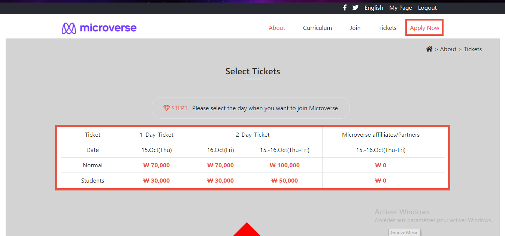

# HTML-CSS-Capstone

> The Conference Page

The page which was to be designed was the conference page designed by Cindy Shin on Behance but since we were asked to personnalise it I have changed some things like the content of the page but the desing is respected. The project has being built mainly with bootstrap, some CSS, HTML and a little of media queries. This project has been built in less than 3 days.

## Built With

-   HTML5
-   CSS3
-   Twitter Bootstrap
-   Media Queries

## Live Demo

[Live Demo Link](https://raw.githack.com/emmanuellekamwa/HTML-CSS-Capstone/feature-branch/main.html)

## Author

👤 **Emmanuelle Kamwa**

-   Github: [@emmanuellekamwa](https://github.com/emmanuellekamwa)
-   Twitter: [@AlixKamwa](https://twitter.com/AlixKamwa)
-   Linkedin: [emmanuelle-kamwa-86145a1a4](https://www.linkedin.com/in/emmanuelle-kamwa-86145a1a4/)

# Credit

This credit is given to the author of the design Cindy Shin
https://creativecommons.org/licenses/by-nc/4.0/

# Show Some Support

Give a ⭐ if you've liked my project and your comments are highly accepted.
